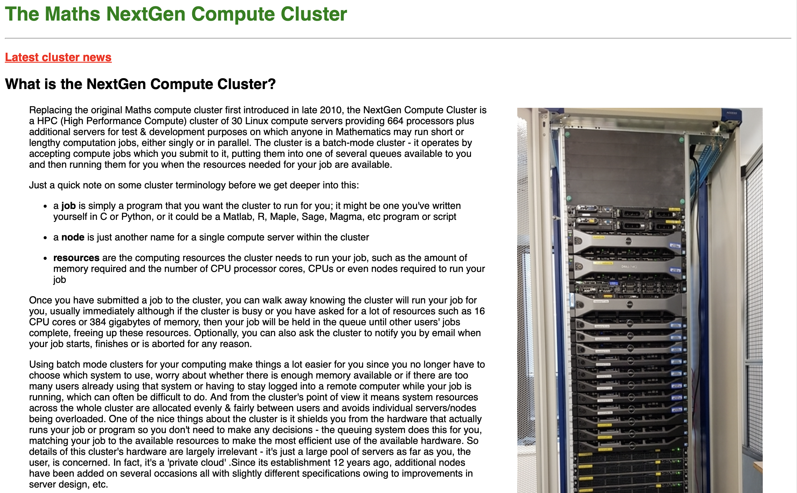
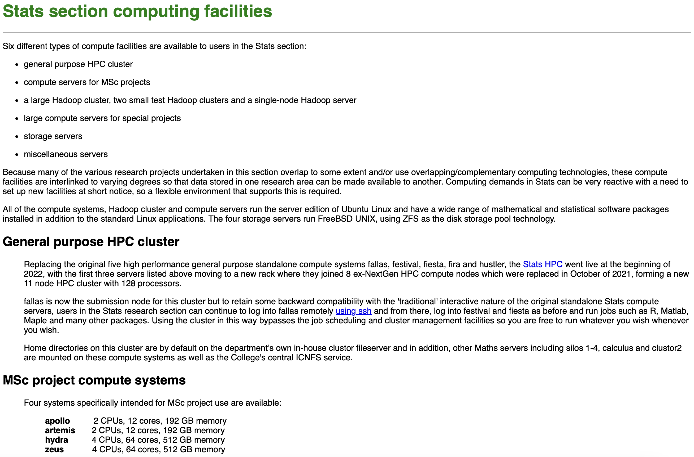

```{r xaringanExtra, echo = FALSE}
  xaringanExtra::use_progress_bar(color = "#035AA6", location = "bottom")
```

<!-- edit name1 and name2 in the YAML above -->

# Why might you need to use the clusters?

<br />
<br />

--

* Using Linux Clusters for better performance in your work.

--

* To accomplish large scale computational tasks, simulations, and statistical modelling.

--

* Need to access collaborative work or group uses it for resource management.

--

* Mostly because your local machine is not up to the task!

---

# What is a Linux Cluster?

<br />
<br />
--

* A linux cluster is a group of Linux computers, or nodes, working as one system.

--

* Imperial has many different clusters but not all of them are for you.

--

* Make sure you are trying to access the right cluster. 

--

* [Andy Thomas](http://ic.time-domain.co.uk) is generally the owner and maintainer of the clusters.

---
# Warnings

<br />
<br />
<br />

--

* Before using the cluster be familiar with high-performance computing techniques.

<br />
<br />

--

* Read the documentation for the cluster before emailing people to ask how it works!
---

---
class: center, middle

# Clusters at Imperial

---

# Maths Next Gen Cluster

--

The [Maths Next Gen Cluster](https://sysnews.ma.ic.ac.uk/compute-cluster/) is the most used cluster at Imperial.

--

{width=50%}
---

# Statistics Cluster

--

The [Statistics Cluster](https://sysnews.ma.ic.ac.uk/stats/index.html) is also available to you.

--

{width=50%}
---

# Accessing the Cluster

<br/>

--

Regardless of the cluster you use the process is basically the same. Here are the steps:

--

* Email and ask the maintainer of the cluster for access. 

--

* Once given access, ensure you are either on site or connected to the IC VPN.

--

* Then, type a command of the form **ssh your_username@cluster_hostname** into the terminal.

--

* You then are prompted for a password which is normally randomly generated that you then set the first time you login.

--

* **You are now connected**

--

* Always logout when you're finished.

---

# Transferring Files

<br/>

--

SCP stands for Secure Copy Protocol and is a way to securely transfer files. In general:

--

* Local to Remote: **scp local_file username@hostname:remote_directory/**

* Remote to Local: **scp username@hostname:remote_file local_directory/**

--

Always ensure that the correct path of source and destination are being used.

--

Note also:

* Use \* for transferring multiple files.
* Use **-r** option to transfer directories.

---

# Queueing Jobs

<br/>

--

A queueing system exists for task management and to share resources! Common tools for this are Slurm, TORQUE, SGE. The preference at Imperial (I think) is TORQUE. This allows you to 

--

* Submit jobs and leave them in the queue so when resources become available the job automatically starts.

--

* Monitor the status of your jobs.

--

* Delete a job before its completion.

--

There is other stuff it can do as well but these are the commands that are necessary.

---

# Submitting Jobs to the Queue

<br/>

--

So once you have used **scp** to get the file you wish to run onto the cluster, it then needs to be run. Do this by:

--

* Use **qsub** command to submit jobs. For instance, **qsub my_script.sh**

--

The job is then added to the queue and is given an ID. The clusters can be set up to give you status updates (read the full documentation or email me). However, if you are logged on:

--

* Use **qstat** command to check the status of your job.

--

If you have realised you no longer want a file to run, use **qdel** to terminate the task.

---

# Retrieving the Output

<br/>

--
By default, the output file is usually stored in the job submission directory. You can use **cat** or **less** to view your output. Further to this:

* **cat job_name.ojob_id** is to view output itself.

* **cat job_name.ejob_id** is to view the error logs.
 
--

Once you are happy with the output, then **scp** the file back to your local machine.

---

# Final Tips and Good Practices

<br/>
--

* Always log out!

<br/>

--

* Regularly clean old files and delete what you don't need!

<br/>

--

* Don't overload the system, respect shared resources.

<br/>

--

* Keep your credentials secure, don't share sensitive information.

<br/>

--

* Ask for help when needed but, consider asking one another before going straight to Andy Thomas. 

---
class: center, middle

# Questions

Please ask questions or submit them at [menti.com](https://www.menti.com/al83uv4zs6br) using code **5606 7649**